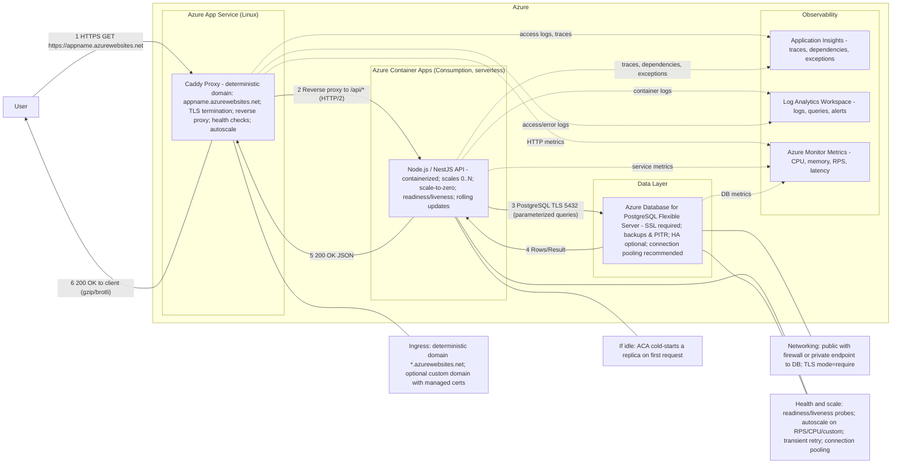

# 🚀 Quickstart for Azure Landing Zone

## ⚠️ 🚧 **WORK IN PROGRESS - DRAFT** 🚧 ⚠️

> **🚨 Important Notice**: This template is currently under active development and should be considered a **DRAFT** version. Features, configurations, and documentation may change without notice. Use in production environments is **not recommended** at this time.


[](LICENSE)
[](https://github.com/bcgov/repomountie/blob/master/doc/lifecycle-badges.md)

A production-ready, secure, and compliant infrastructure template for deploying containerized applications to Azure Landing Zone environments. This template follows Azure Landing Zone security guardrails and BC Government cloud deployment best practices.

## 🎯 What This Template Provides

- **Full-stack containerized application**: NestJS backend + React/Vite frontend
- **Secure Azure infrastructure**: Landing Zone compliant with proper network isolation
- **Database management**: PostgreSQL with Flyway migrations and optional CloudBeaver admin UI
- **CI/CD pipeline**: GitHub Actions with OIDC authentication
- **Infrastructure as Code**: Terraform with environment-specific `.tfvars` and a CI-friendly wrapper script
- **Monitoring & observability**: Azure Monitor, Application Insights, and comprehensive logging
- **Security best practices**: Managed identities, private endpoints, and network security groups

## 📋 Prerequisites

### Required Tools
- **Azure CLI** v2.50.0+ - [Installation Guide](https://docs.microsoft.com/en-us/cli/azure/install-azure-cli)
- **GitHub CLI** v2.0.0+ - [Installation Guide](https://cli.github.com/)
- **Terraform** v1.5.0+ - [Installation Guide](https://developer.hashicorp.com/terraform/downloads)
- **Docker** or **Podman** - [Docker Installation](https://docs.docker.com/get-docker/)

### Required Accounts & Permissions
- **BCGOV Azure account** with appropriate permissions - [Registry Link](https://registry.developer.gov.bc.ca/)
- **GitHub repository** with Actions enabled
- **Azure subscription** with Owner or Contributor role
- **Access to Azure Landing Zone** with network connectivity configured


## 📁 Project Structure

```
/quickstart-azure-containers
├── .github/                   # GitHub Actions CI/CD workflows & agents
│   ├── codeowners             # Code ownership assignments
│   ├── agents/                # GitHub Copilot custom agents
│   │   ├── coding.agent.md    # Coding standards and best practices
│   │   ├── review.agent.md    # Code review guidelines
│   │   ├── instructions/      # Additional guidance (if applicable)
│   ├── ISSUE_TEMPLATE/        # GitHub issue templates
│   ├── graphics/              # Images for workflows/docs
│   ├── pull_request_template.md # PR template
│   └── workflows/             # GitHub Actions workflows
│       ├── .builds.yml        # Container image builds
│       ├── .deployer.yml      # Infrastructure deployment
│       ├── .deploy_stack.yml  # Stack deployment automation
│       ├── .destroy_stack.yml # Stack teardown automation
│       ├── .stack-prefix.yml  # Stack prefix generation
│       ├── .tests.yml         # Test suite execution
│       ├── pr-open.yml        # PR create/update workflow
│       ├── pr-close.yml       # PR close & cleanup workflow
│       ├── pr-validate.yml    # Code quality & validation
│       └── prune-env.yml      # Stale environment cleanup
├── infra/                     # Terraform infrastructure code
│   ├── main.tf                # Root module configuration
│   ├── providers.tf           # Azure provider configuration
│   ├── variables.tf           # Global variables
│   ├── outputs.tf             # Infrastructure outputs
│   ├── backend.tf             # Remote state configuration (optional)
│   ├── .tflint.hcl            # Terraform linter config
│   ├── deploy-terraform.sh    # Deployment helper script
│   ├── scripts/               # Utility scripts for Terraform operations
│   │   ├── extract-import-target.sh      # Extract Terraform import targets
│   │   └── extract-import-target.test.sh # Test suite for import extraction
│   └── modules/               # Reusable infrastructure modules
│       ├── aci/               # Azure Container Instances (optional)
│       ├── apim/              # API Management (optional)
│       ├── backend/           # App Service for NestJS API
│       ├── container-apps/    # Container Apps
│       ├── flyway/            # Flyway database migrations
│       ├── frontend/          # App Service for React SPA (with Caddy proxy)
│       ├── frontdoor/         # Azure Front Door
│       ├── monitoring/        # Log Analytics & Application Insights
│       ├── network/           # VNet, subnets, NSGs
│       └── postgresql/        # PostgreSQL Flexible Server
├── backend/                   # NestJS TypeScript API
│   ├── src/                   # API source code
│   │   ├── main.ts            # Entry point (initializes telemetry before bootstrap)
│   │   ├── app.module.ts      # Root NestJS module
│   │   ├── app.controller.ts  # Default app controller
│   │   ├── app.service.ts     # Default app service
│   │   ├── health.controller.ts       # Health check endpoint (/api/health)
│   │   ├── metrics.controller.ts      # Prometheus metrics (/api/metrics)
│   │   ├── common/            # Shared utilities & logger config
│   │   ├── middleware/        # Request/response logging middleware
│   │   ├── users/             # User management module (example)
│   │   ├── prisma.module.ts   # Prisma ORM module
│   │   ├── prisma.service.ts  # Prisma service
│   │   ├── telemetry.ts       # Azure Monitor telemetry setup
│   │   └── prom.ts            # Prometheus metrics setup
│   ├── prisma/                # Prisma ORM configuration
│   │   └── schema.prisma      # Database schema (ORM only; migrations via Flyway)
│   ├── test/                  # E2E tests
│   │   └── app.e2e-spec.ts    # E2E test suite
│   ├── eslint.config.mjs      # ESLint configuration
│   ├── nest-cli.json          # NestJS CLI configuration
│   ├── package.json           # Dependencies & scripts
│   ├── tsconfig.json          # TypeScript configuration
│   ├── tsconfig.build.json    # Build-specific TypeScript config
│   ├── vitest.config.mts      # Vitest unit test configuration
│   └── Dockerfile             # Container build configuration
├── frontend/                  # React + Vite SPA
│   ├── src/                   # Frontend source code
│   │   ├── main.tsx           # React entry point
│   │   ├── index.css          # Global styles
│   │   ├── components/        # React components (BC Gov Design System)
│   │   ├── routes/            # File-based routing (TanStack Router)
│   │   ├── routeTree.gen.ts   # Auto-generated route tree (do not edit)
│   │   ├── service/           # API integration (Axios client)
│   │   ├── interfaces/        # TypeScript interfaces
│   │   ├── scss/              # Sass stylesheets
│   │   ├── assets/            # Static assets
│   │   ├── __tests__/         # Component tests
│   │   ├── test-setup.ts      # Test setup & utilities
│   │   └── test-utils.tsx     # Test helper components
│   ├── e2e/                   # Playwright end-to-end tests
│   │   ├── qsos.spec.ts       # Example E2E tests
│   │   ├── pages/             # Playwright page objects
│   │   └── utils/             # Test utilities
│   ├── public/                # Static assets served as-is
│   ├── eslint.config.mjs      # ESLint configuration
│   ├── package.json           # Dependencies & scripts
│   ├── tsconfig.json          # TypeScript configuration
│   ├── tsconfig.node.json     # Build tool TypeScript config
│   ├── vite.config.ts         # Vite configuration (with /api proxy for dev)
│   ├── vitest.config.ts       # Vitest unit test configuration
│   ├── playwright.config.ts   # Playwright E2E configuration
│   ├── Caddyfile              # Caddy reverse proxy config (production)
│   ├── index.html             # HTML entry point
│   └── Dockerfile             # Container build configuration
├── migrations/                # Flyway database migrations
│   ├── sql/                   # SQL migration scripts (V*.sql format)
│   ├── Dockerfile             # Migration runner container
│   └── entrypoint.sh          # Migration execution script
├── .diagrams/                 # Architecture diagrams (if applicable)
├── docs/                      # Additional documentation (currently empty)
├── logs/                      # Log output directory
├── .github/                   # (Covered above)
├── .vscode/                   # VS Code workspace settings
├── CODE_OF_CONDUCT.md         # Code of conduct
├── COMPLIANCE.yaml            # Compliance configuration
├── CONTRIBUTING.md            # Contribution guidelines
├── SECURITY.md                # Security guidelines
├── GHA.md                     # GitHub Actions documentation
├── initial-azure-setup.sh     # Azure setup automation (OIDC, service principal)
├── package.json               # Monorepo root (ESLint, Prettier)
├── package-lock.json          # Dependency lock file
├── eslint.config.mjs          # Root ESLint configuration
├── .prettierrc.yml            # Prettier formatting config
├── .prettierignore            # Prettier ignore patterns
├── tsconfig.json              # Root TypeScript configuration
├── renovate.json              # Dependency update automation
├── test.http                  # REST client test file (VSCode REST Client)
├── LICENSE                    # Apache 2.0 license
├── README.md                  # This file
├── .gitignore                 # Git ignore patterns
├── .gitattributes             # Git attributes
└── .git/                      # Git repository (local)
```

## Target Architecture

## 🚀 Quick Start Guide

### 1. Clone and Setup Repository

```bash
# Use this template to create a new repository
gh repo create my-azure-app --template bcgov/quickstart-azure-containers --public

# Clone your new repository  
git clone https://github.com/your-org/my-azure-app.git
cd my-azure-app
```

### 2. Configure Azure Environment

The `initial-azure-setup.sh` script automates the complete Azure environment setup with OIDC authentication for GitHub Actions.

#### Prerequisites for Setup Script
- **Azure CLI** logged in (`az login`)
- **GitHub CLI** (required; the setup script uses `gh api` to resolve immutable GitHub OIDC subject IDs)
- **Azure subscription** with appropriate permissions
- **Existing Azure Landing Zone** resource group

> GitHub Actions uses the immutable OIDC subject format `repo:OWNER@OWNER_ID/REPO@REPO_ID:environment:ENV`, and Azure matches that string exactly. Run `initial-azure-setup.sh` once per GitHub environment you intend to deploy to (`dev`, `test`, `prod`, `tools`). If you previously ran the script and are now seeing `AADSTS700213`, re-run it for each environment to refresh the federated credential subject.

#### Initial Setup for GHA and Terraform 

```bash
# Make the setup script executable
chmod +x initial-azure-setup.sh
```
- follow the instruction in the header section of the file.


#### What the Setup Script Does

**🔐 Identity & Authentication:**
- Creates a user-assigned managed identity in your Landing Zone resource group
- Configures OIDC federated identity credentials for GitHub Actions
- Sets up environment-specific authentication (no secrets stored in Azure)

**💾 Terraform State Management:**
- Creates a secure Azure storage account for Terraform state files
- Enables blob versioning for state file protection
- Configures appropriate access permissions for the managed identity

**🔑 GitHub Integration:**
- Automatically creates GitHub environment if `--create-github-secrets` is used
- Sets up required secrets in your GitHub repository:
  - `AZURE_CLIENT_ID`
  - `AZURE_TENANT_ID` 
  - `AZURE_SUBSCRIPTION_ID`
  - `VNET_NAME` (derived from resource group)
  - `VNET_RESOURCE_GROUP_NAME`

**⚡ Azure Permissions:**
- Assigns security group to the managed identity aligned with landing zone policy.
- Configures storage-specific permissions for Terraform state management
- Validates all configurations and provides verification


#### Post-Setup Verification

After running the script, verify the setup:

```bash
# Check managed identity was created
az identity show --name "my-app-github-identity" --resource-group "ABCD-dev-networking"

# Verify federated credentials
az identity federated-credential list --identity-name "my-app-github-identity" --resource-group "ABCD-dev-networking"

# Test GitHub Actions authentication (in your repository)
gh workflow run test-azure-connection  # if you have a test workflow
```

### 3. Configure GitHub Secrets (If Not Auto-Created)

If you didn't use the `--create-github-secrets` flag, manually add the following secrets to your GitHub repository (`Settings > Secrets and variables > Actions > Environment secrets`):

#### Required Environment Secrets
```bash
AZURE_CLIENT_ID=<managed-identity-client-id>
AZURE_TENANT_ID=<your-azure-tenant-id>
AZURE_SUBSCRIPTION_ID=<your-azure-subscription-id>
VNET_NAME=<landing-zone-vnet-name>
VNET_RESOURCE_GROUP_NAME=<landing-zone-rg-name>
```


💡 **Tip**: The setup script outputs the exact values to use for these secrets if you didn't use auto-creation.

### 4. Local Development Setup

```bash
# Install dependencies for all packages
npm install

# Start local development environment
docker-compose up -d

# Run database migrations
docker-compose exec migrations flyway migrate

# Start backend development server
cd backend && npm run start:dev

# Start frontend development server (in new terminal)
cd frontend && npm run dev
```

Access your local application:
- **Frontend**: http://localhost:5173
- **Backend API**: http://localhost:3000 (default; see `docker-compose.yml` for overrides)
- **Database**: localhost:5432 (postgres/default)

## 🚢 Deployment Process

### Automated Deployment via GitHub Actions

The repository includes comprehensive CI/CD workflows:

#### Build Containers

The CI/CD pipeline builds the following container images:
- **backend**: NestJS API server
- **migrations**: Flyway database migration runner
- **frontend**: React SPA with Caddy reverse proxy
These are built on every commit and tagged for deployment to your chosen environment.

### Manual Deployment

#### Deploy Infrastructure
```bash
# From repo root
cd infra

# CI (and recommended local usage) configures the AzureRM remote backend via env vars.
# Required backend env vars:
# - BACKEND_RESOURCE_GROUP
# - BACKEND_STORAGE_ACCOUNT
# - BACKEND_CONTAINER_NAME (default: tfstate)
# - BACKEND_STATE_KEY (example: <stack_prefix>/<app_env>/terraform.tfstate)

# Initialize + plan using an environment tfvars file (examples: tools.tfvars, dev.tfvars)
./deploy-terraform.sh init -var-file=tools.tfvars
./deploy-terraform.sh plan -var-file=tools.tfvars

# Apply
./deploy-terraform.sh apply -var-file=tools.tfvars
```

Deployment topology:
- Preferred: App Service frontend (Caddy) + Container Apps backend (runtime reverse proxy via `VITE_BACKEND_URL`).
- Alternative: App Service frontend + App Service backend for low-scale use cases (disable Container Apps).

## 🗄️ Database Management

### Schema Migrations with Flyway

The template uses Flyway for database schema management:

#### Migration Files (`migrations/sql/`)
```sql
-- V1.0.0__init.sql
CREATE SCHEMA IF NOT EXISTS app;

CREATE TABLE app.users (
    id SERIAL PRIMARY KEY,
    email VARCHAR(255) UNIQUE NOT NULL,
    created_at TIMESTAMP DEFAULT CURRENT_TIMESTAMP
);
```

#### Running Migrations
```bash
# Local development
docker-compose exec migrations flyway migrate

# Production (via container)
docker run --rm \
  -v $(pwd)/migrations/sql:/flyway/sql:ro \
  -e FLYWAY_URL=jdbc:postgresql://your-db:5432/app \
  -e FLYWAY_USER=your-user \
  -e FLYWAY_PASSWORD=your-password \
  flyway/flyway:11-alpine migrate
```

### Database Administration with CloudBeaver

Optional CloudBeaver container provides web-based database management:

- **Access**: `https://your-app-cloudbeaver.azurewebsites.net`
- **Features**: Query editor, schema browser, data export/import
- **Auto-Configuration**: Database connection details are automatically configured from environment variables on startup, eliminating the need for manual connection setup. The connection persists across container restarts.
- **Security Note**: Credentials are stored in the CloudBeaver configuration for convenience. This is suitable for development and administrative use cases where the container is already secured through Azure's network isolation, private endpoints, and access controls.

## 🔐 Security Features

### Azure Security Best Practices

#### Network Security
- **Private endpoints** for all Azure services
- **Network Security Groups** with least-privilege rules
- **Azure Front Door** with WAF protection
- **VNet integration** for App Services

#### Identity & Access Management
- **Managed identities** for service-to-service authentication
- **OIDC authentication** for GitHub Actions (no stored credentials)

#### Application Security
- **HTTPS everywhere** with TLS 1.3 minimum
- **Security headers** (HSTS, CSP, X-Frame-Options)
- **Container scanning** in CI/CD pipeline

### Security Configuration Examples

#### App Service Security (`infra/modules/backend/main.tf`)
```hcl
resource "azurerm_linux_web_app" "backend" {
  # ... other configuration
  
  site_config {
    minimum_tls_version = "1.3"
    ftps_state         = "Disabled"
    
    # IP restrictions for enhanced security
    ip_restriction {
      service_tag = "AzureFrontDoor.Backend"
      action      = "Allow"
      priority    = 100
      headers {
        x_azure_fdid = [var.frontend_frontdoor_resource_guid]
      }
    }
    
    ip_restriction {
      name       = "DenyAll"
      action     = "Deny"
      priority   = 500
      ip_address = "0.0.0.0/0"
    }
  }
}
```

## 📊 Monitoring & Observability

### Azure Monitor Integration

#### Application Insights Setup
```hcl
resource "azurerm_application_insights" "main" {
  name                = "${var.app_name}-appinsights"
  location            = var.location
  resource_group_name = var.resource_group_name
  application_type    = "web"
  workspace_id        = azurerm_log_analytics_workspace.main.id
}
```

### Backend Telemetry and Log Routing

The backend now splits observability data by intent instead of sending every message to Application Insights:

- `AppTraces` receive curated Nest/Winston application logs, exceptions, traces, and dependency telemetry.
- `Log Analytics Workspace` receives high-volume operational stdout/stderr logs such as HTTP access logs and Prisma slow-query diagnostics.
- Azure Monitor trace-based log sampling remains enabled so logs correlated to unsampled traces are not exported as orphaned `AppTraces` entries.

Backend logging behavior is controlled through Terraform and injected into App Service and Container Apps:

- `backend_log_level`: structured Nest/Winston log level exported through Application Insights. Defaults to `info` in production.
- `backend_http_access_log_mode`: `off`, `failures`, or `all` for request access logs written to stdout/stderr. Production default is `failures`.
- `backend_slow_query_log_threshold_ms`: Prisma slow-query threshold for operational logs. Set `-1` to disable.
- `OTEL_SERVICE_NAME`: pinned to `${var.app_name}-backend` so telemetry from different Azure hosts lands under one logical service.
- `OTEL_RESOURCE_ATTRIBUTES`: includes `deployment.environment.name=${var.app_env}` for environment scoping.

Operational guidance:

- Keep `backend_log_level` at `info` or `warn` in production unless actively debugging.
- Keep `backend_http_access_log_mode = "failures"` for normal production use to avoid ingesting successful request noise.
- Do not set `backend_http_access_log_mode = "off"` if you want Container Apps HTTP 5xx alerting, because the cross-host 5xx query relies on structured `http_request` logs from the backend.
- Start with `backend_slow_query_log_threshold_ms = 1000` and lower it temporarily during performance investigations.

### Application Alerting

Terraform now creates a dedicated application alerting layer when recipients are configured:

- Application Insights smart detectors for failure anomalies, request latency regressions, dependency latency regressions, and exception-volume spikes.
- Log Analytics scheduled query alerts for repeated backend HTTP 5xx responses from Container Apps request logs, startup/runtime failures, and database connectivity issues.
- Metric alerts for backend App Service HTTP 5xx volume as a platform backstop and backend Container App restart counts.

Scheduled query alert cadence:

- The scheduled query alerts in this repo evaluate every five minutes over a five-minute rolling window.
- Azure Monitor scheduled query alert cost scales with how often the rule executes. A one-minute cadence runs roughly five times as many evaluations as a five-minute cadence for the same rule, so it improves time-to-detect at the cost of higher alert-query spend.
- Azure rejected the current runtime, database, and Container Apps 5xx queries at one-minute frequency. The runtime and database rules use multi-table `union` queries, and the Container Apps 5xx rule depends on the current log shape in `ContainerAppConsoleLogs_CL`, so the supported configuration here remains `PT5M`.
- Backend App Service 5xx coverage is still faster because the native `Http5xx` metric alert runs every minute and doesn't have the same log-query limitation.
- If Azure later exposes a 5xx request-count metric for Container Apps or relaxes the one-minute log-alert restrictions, revisiting `scheduled_query_default_evaluation_frequency` in `infra/modules/app-alerting/locals.tf` is the place to start.

Key Terraform variables:

- `enable_application_alerts`: master switch for application alert resources.
- `application_alert_emails`: email recipients for application alerts. If empty, Terraform reuses `postgres_alert_emails` when available.
- `backend_http_5xx_alert_threshold`: Container Apps 5xx total in five minutes before the backend HTTP 5xx log alert fires.
- `application_runtime_issue_alert_threshold`: count threshold for runtime/startup failure log matches.
- `application_database_issue_alert_threshold`: count threshold for database connectivity failures.
- `app_service_http_5xx_alert_threshold`: 5xx total in five minutes before the App Service platform metric backstop alert fires.
- `container_app_restart_alert_threshold`: restart total in fifteen minutes before the Container Apps alert fires.

### PostgreSQL Backups & Point-In-Time Recovery (PITR)

Azure PostgreSQL Flexible Server automatically supports point-in-time restore (PITR) to any moment within the configured backup retention window (`postgres_backup_retention_period`).

Key points:
- PITR window = retention days (7–35) you set in Terraform.
- Geo-redundant backup (`postgres_geo_redundant_backup_enabled = true`) improves DR but adds cost.
- Restores create a new server; you then repoint apps / rotate connection strings.

Restore example (CLI):
```bash
az postgres flexible-server restore \
  --resource-group <rg> \
  --name <new-server-name> \
  --source-server <current-server-name> \
  --restore-time "2025-08-12T15:04:05Z"
```

### PostgreSQL Logging & Cost Tuning

Variables controlling verbosity:
- `postgres_enable_server_logs`: Master toggle for connection / duration logging.
- `postgres_log_statement_mode`: none | ddl | mod | all (default ddl). Avoid `all` in production unless debugging.
- `postgres_log_min_duration_statement_ms`: Slow query threshold (default 500 ms). Lower value = more logs & cost.
- `postgres_track_io_timing`: Enables IO timing (slight overhead, useful for perf diagnostics).
- `postgres_pg_stat_statements_max`: Controls number of statements tracked; higher values consume more memory.

Recommendations:
| Scenario | log_statement | log_min_duration_statement_ms | Notes |
|----------|---------------|--------------------------------|-------|
| Prod steady state | ddl | 500–1000 | Focus on schema changes + slow queries |
| Perf investigation | mod or all | 100–250 | Temporarily increase verbosity |
| Heavy cost pressure | none | 1000–2000 | Minimize ingestion volume |

If you disable full statement logging (`none`/`ddl`) ensure slow query threshold captures problematic queries (set <= 1000 ms initially).

### Metric Alert Customization

Metric alerts are enabled when `postgres_alerts_enabled = true`. Customize or add alerts via `postgres_metric_alerts` map. Default keys: `cpu_percent`, `storage_used`, `active_connections`.

Example override in `terraform.tfvars`:
```hcl
postgres_alerts_enabled = true
postgres_alert_emails   = ["dba-team@example.com", "oncall@example.com"]
postgres_metric_alerts = {
  cpu_percent = {
    metric_name = "cpu_percent"
    operator    = "GreaterThan"
    threshold   = 75
    aggregation = "Average"
    description = "CPU > 75% (tuned)"
  }
  failed_connections = {
    metric_name = "connections_failed"
    operator    = "GreaterThan"
    threshold   = 5
    aggregation = "Total"
    description = "Failed connections spike"
  }
}
```

Supported metric names (common): `cpu_percent`, `storage_used`, `active_connections`, `connections_failed`, `deadlocks`, `serverlog_storage_percent`.

Action Group:
- Created only if `postgres_alert_emails` is non-empty.
- Add/remove emails without recreating alerts (resource uses dynamic receivers).

### High Availability SKU Validation

If `postgres_ha_enabled = true`, Terraform validates that `postgres_sku_name` starts with `GP_` or `MO_` (General Purpose / Memory Optimized). Adjust SKU before enabling HA to avoid apply failure.


#### Log Analytics Workspace
```hcl
resource "azurerm_log_analytics_workspace" "main" {
  name                = "${var.app_name}-log-analytics"
  location            = var.location
  resource_group_name = var.resource_group_name
  sku                 = var.log_analytics_sku
  retention_in_days   = var.log_analytics_retention_days
}
```


### Monitoring Dashboards

Access monitoring through:
- **Azure Portal**: Resource group > Monitoring
- **Application Insights**: Performance, failures, dependencies
- **Log Analytics**: Custom queries and alerts
- **Azure Monitor**: Infrastructure metrics and alerts


### Testing in CI/CD

The GitHub Actions workflows include:
- **Unit tests + lint + coverage** for frontend and backend (backend uses a Postgres service for tests)
- **IaC linting** via `tflint` (recursive)
- **Security scanning** via Trivy (repo scan, SARIF upload)

## 🏷️ Environment Management

### Multi-Environment Setup

The template supports multiple environments with GitHub Action Environments:

#### Feature Flag Variables

Key infrastructure feature toggles controlled in `terraform.tfvars` and environment-specific `.tfvars` files:

| Variable | Purpose | Default |
|----------|---------|---------|
| `enable_app_service_backend` | Host the backend on App Service (default backend hosting) | `true` |
| `enable_container_apps` | Host the backend on Azure Container Apps (optional, alongside App Service) | `false` |
| `enable_frontdoor` | Deploy Azure Front Door for global distribution | `false` |
| `enable_apim` | Deploy API Management for API gateway capabilities | `false` |

#### Environment-Specific Configuration

Each environment (`dev.tfvars`, `test.tfvars`, `tools.tfvars`, `prod.tfvars`) can override defaults:

```hcl
# tools.tfvars - Development environment with all optional services
app_service_sku_name_backend = "B1"
```

#### Terraform Module Variables

Common variables passed to modules from the root:

- `use_oidc`: Enable OIDC authentication for service principals
- All standard Azure variables (subscription_id, tenant_id, location, etc.)


## 🚨 Troubleshooting

### Common Issues and Solutions

#### 1. GitHub Actions Deployment Failures

**Issue**: OIDC authentication fails
```
Error: No subscription found. Run 'az account set' to select a subscription.
```

**Solution**: 
- Verify `AZURE_CLIENT_ID`, `AZURE_TENANT_ID`, and `AZURE_SUBSCRIPTION_ID` secrets
- Check whether the repository currently emits a legacy or immutable OIDC subject, using GitHub's OIDC subject preview, and ensure the managed identity has a matching federated credential
- For an existing repository, add the immutable credential alongside the legacy credential, enable immutable subjects in GitHub, validate a workflow, and only then remove the legacy credential; repeat for each environment (`dev`, `test`, `prod`, `tools`)

#### 2. Terraform State Issues

**Issue**: State file conflicts or locks
```
Error: Error acquiring the state lock
```

**Solution**:
```bash
# Force unlock (use with caution)
cd infra
terraform force-unlock <lock-id>

# Or check Azure storage account permissions
az storage blob list --account-name your-storage --container-name tfstate
```

If CI fails with an Azure "already exists" error, `infra/deploy-terraform.sh` will attempt an automatic `terraform import` using `infra/scripts/extract-import-target.sh` and retry the apply.

#### 3. Container Deployment Issues - ACR (Azure Container Registry)

**Issue**: App Service fails to pull container (if using ACR)
```
Error: Failed to pull image: unauthorized
```

**Solution**:
- Verify managed identity has `AcrPull` role on container registry
- Check container registry URL in app settings
- Ensure container image exists and is accessible

#### 4. Database Connection Issues

**Issue**: Backend cannot connect to PostgreSQL
```
Error: getaddrinfo ENOTFOUND your-postgres-server
```

**Solution**:
- Verify VNet integration and private endpoint configuration
- Check PostgreSQL firewall rules
- Ensure connection string environment variables are correct
- if you are using pgpool make sure you have this line `ssl: process.env.PGSSLMODE === 'require' ? { rejectUnauthorized: false } : false,`


### Debugging Tools

#### 1. Azure CLI Debugging
```bash
# Enable debug logging
az config set core.log_level=debug

# Check resource status
az webapp show --name your-app --resource-group your-rg

# View app service logs
az webapp log tail --name your-app --resource-group your-rg
```


## 📚 Additional Resources

### Documentation Links
- [Terraform Azure Provider](https://registry.terraform.io/providers/hashicorp/azurerm/latest/docs)
- [NestJS Documentation](https://docs.nestjs.com/)
- [React + Vite Documentation](https://vitejs.dev/guide/)
- [Prisma Documentation](https://www.prisma.io/docs/)


## 🤝 Contributing

We welcome contributions to improve this template! Please see our [Contributing Guidelines](CONTRIBUTING.md) for details.

## 📜 License

This project is licensed under the Apache License 2.0 - see the [LICENSE](LICENSE) file for details.

**Built with ❤️ by the NRIDS Team**